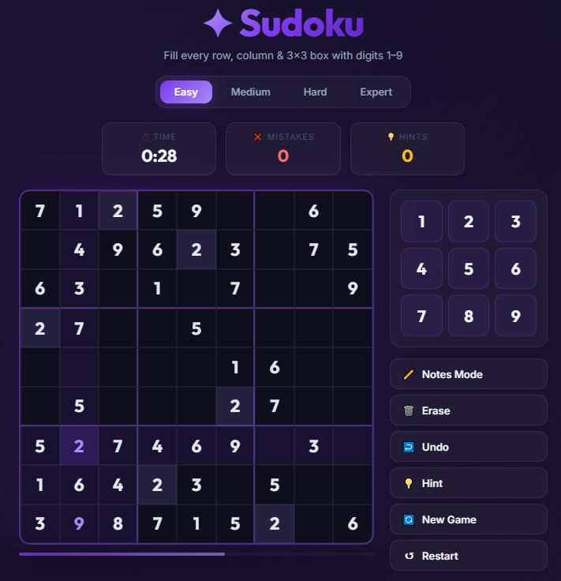
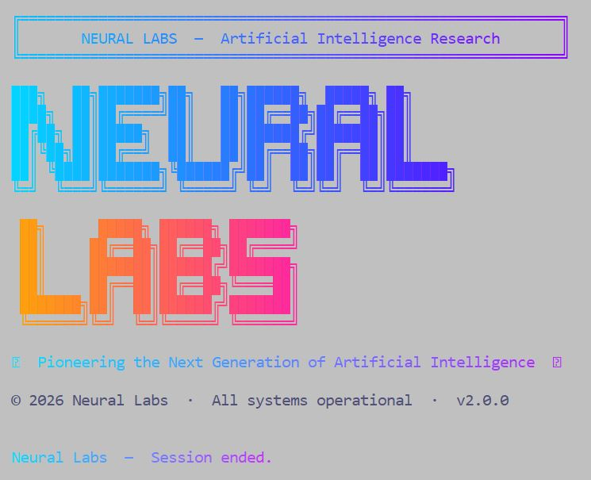
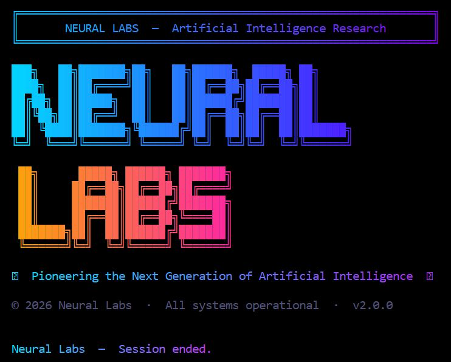
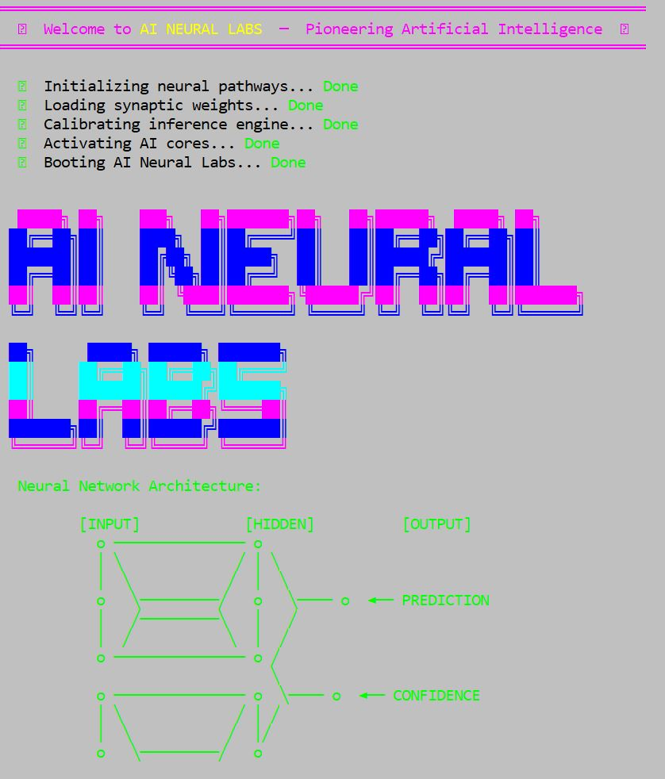
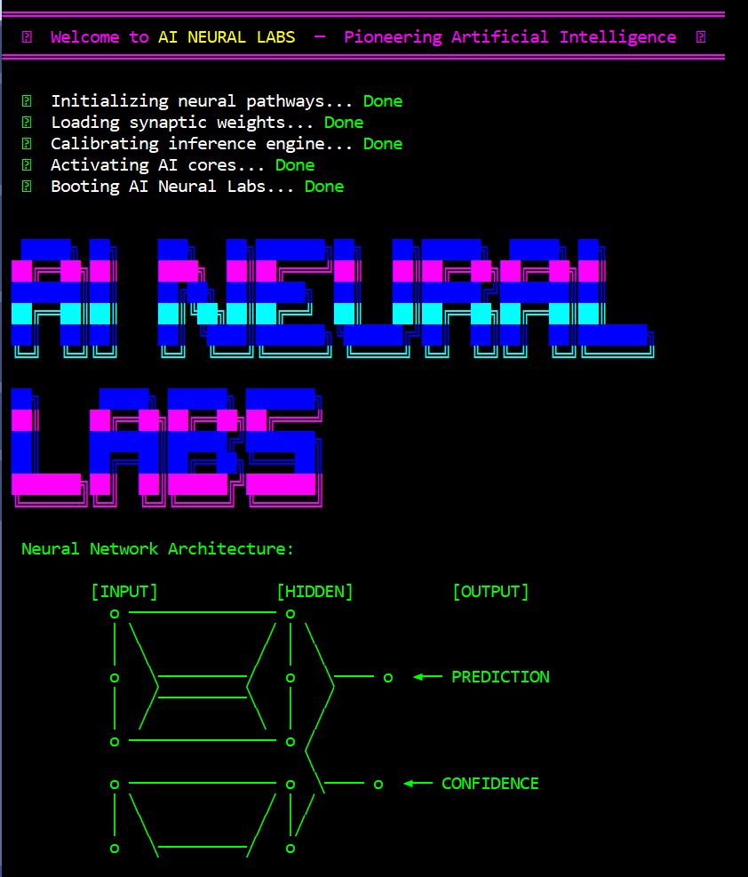

# Google Antigravity  
https://antigravity.google/  
All projects were built with the Antigravity IDE
  
OS: Windows  
Python: https://www.python.org/downloads/

## License
This project is licensed under the MIT License - see the [LICENSE](LICENSE) file for details.

## Sudoku Game
**Prompt**: create a sudoku game. ask me the questions you want.  
**Model**: Gemini 3.1 Pro  
**Time**: 5 minutes  
**File**: sudoku_v2.html  
**Notes**: the game worked from the first iteration. I didn't do any manual corrections.  It shows incorrectly in mobile devices.  
**Test**: to test the game, download the html file and open it in a web browser.  
 

## Neural Labs Animation
**Prompt**: create another script that reads Neural Labs in ascii arts and has animation  
**Model**: Gemini 3.1 Pro  
**Time**: 5 minutes  
**File**: neural_labs.py  
**Notes**: I needed to prompt a couple more times for corrections  
**Test**: to test, download the python file and run it in a terminal  
  
  

## ASCII Art
**Prompt**: with ascii characters arts, create a script with art that reads "AI Neural Labs"  
**Model**: Gemini 3.1 Pro  
**Time**: 5 minutes  
**File**: ascii_art.py  
**Notes**: I needed to prompt a couple more times for corrections  
**Test**: to test, download the python file and run it in a terminal  
  
  